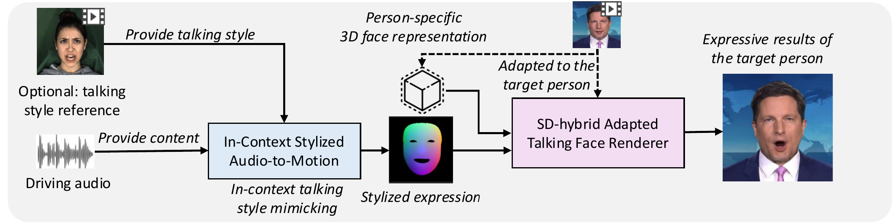

# MimicTalk: Mimicking a personalized and expressive 3D talking face in few minutes | NeurIPS 2024
[](https://arxiv.org/abs/2401.08503)| [](https://github.com/yerfor/MimicTalk) | [中文文档](./README-zh.md)

This is the official repo of MimicTalk with Pytorch implementation, for training a personalized and expressive talking avatar in minutes. The code is built upon our previous work, [Real3D-Portrait](https://github.com/yerfor/Real3DPortrait) (ICLR 2024), which is a one-shot NeRF-based talking avatar system and enables the fast training and good quality of our MimicTalk. You can visit our [Demo Page](https://mimictalk.github.io/) for watching demo videos, and read our [Paper](https://arxiv.org/abs/2410.06734) for technical details.

<p align="center">
    <br>
    
    <br>
</p>


# Quick Start!
## Environment Installation
Please refer to [Installation Guide](docs/prepare_env/install_guide.md), prepare a Conda environment `mimictalk`.
## Download Pre-trained & Third-Party Models
### 3DMM BFM Model
Download 3DMM BFM Model from [Google Drive](https://drive.google.com/drive/folders/1o4t5YIw7w4cMUN4bgU9nPf6IyWVG1bEk?usp=sharing) or [BaiduYun Disk](https://pan.baidu.com/s/1aqv1z_qZ23Vp2VP4uxxblQ?pwd=m9q5 ) with Password m9q5. 


Put all the files in `deep_3drecon/BFM`, the file structure will be like this:
```
deep_3drecon/BFM/
├── 01_MorphableModel.mat
├── BFM_exp_idx.mat
├── BFM_front_idx.mat
├── BFM_model_front.mat
├── Exp_Pca.bin
├── facemodel_info.mat
├── index_mp468_from_mesh35709.npy
└── std_exp.txt
```

### Pre-trained Real3D-Portrait & MimicTalk
Download Pre-trained MimicTalk Checkpoints：[Google Drive](https://drive.google.com/drive/folders/1Kc6ueDO9HFDN3BhtJCEKNCZtyKHSktaA?usp=sharing) or [BaiduYun Disk](https://pan.baidu.com/s/1nQKyGV5JB6rJtda7qsThUg?pwd=mimi) with Password `mimi`

  
Put the zip files in `checkpoints` & `checkpoints_mimictalk` and unzip them, the file structure will be like this:
```
checkpoints/
├── mimictalk_orig
│   └── os_secc2plane_torso
│       ├── config.yaml
│       └── model_ckpt_steps_100000.ckpt
|-- 240112_icl_audio2secc_vox2_cmlr
│     ├── config.yaml
│     └── model_ckpt_steps_1856000.ckpt
└── pretrained_ckpts
    └── mit_b0.pth

checkpoints_mimictalk/
└── German_20s
    ├── config.yaml
    └── model_ckpt_steps_10000.ckpt
```

## Train & Infer MimicTalk in two lines
```
python inference/train_mimictalk_on_a_video.py # train the model, this may take 10 minutes for 2,000 steps
python inference/mimictalk_infer.py # infer the model
```

# Detailed options for train & infer
Currently, we provide **CLI**, **Gradio WebUI** for inference. We support Audio-Driven talking head generation for specific-person (which is from `torso_ckpt`), and at least prepare `driving audio` for inference. Optionly, providing `style video` enables model to predict corressponding talking style with it.

Firstly, switch to project folder and activate conda environment:
```bash
cd <mimictalkRoot>
conda activate mimictalk
export PYTHONPATH=./
export HF_ENDPOINT=https://hf-mirror.com
```

## Gradio WebUI
Run Gradio WebUI demo, upload resouces in webpage，click `Training` button to train a person-specific MimicTalk model, and then click `Generate` button to inference with arbitary audio and style：
```bash
python inference/app_mimictalk.py
```

## CLI Training for specific-person video
Provide `source video` for specific-person:
```bash
python inference/train_mimictalk_on_a_video.py \
--video_id <PATH_TO_SOURCE_VIDEO> \
--max_updates <UPDATES_NUMBER> \
--work_dir <PATH_TO_SAVING_CKPT>
```

Some training optional parameters:
- `--torso_ckpt` Pre-trained Real3d-Portrait checkpoints path
- `--max_updates` The number of training updates.
- `--batch_size` Batch size during training: `1` needs about 8GB VRAM; `2` needs about 15GB
- `--lr_triplane` Learning rate of triplane: for video, 0.1; for an image, 0.001
- `--work_dir` When not assigned, the results will be stored at `checkpoints_mimictalk/`.

Commandline example:
```bash
python inference/train_mimictalk_on_a_video.py \
--video_id data/raw/videos/German_20s.mp4 \
--max_updates 2000 \
--work_dir checkpoints_mimictalk/German_20s
```

## CLI Inference 

Provide `driving audio` and `driving style` (Optionly):
```bash
python inference/mimictalk_infer.py \
--drv_aud <PATH_TO_AUDIO> \
--drv_style <PATH_TO_STYLE_VIDEO, OPTIONAL> \
--drv_pose <PATH_TO_POSE_VIDEO, OPTIONAL> \
--bg_img <PATH_TO_BACKGROUND_IMAGE, OPTIONAL> \
--out_name <PATH_TO_OUTPUT_VIDEO, OPTIONAL>
```

Some inference optional parameters：
- `--drv_pose` provide motion pose information, default to be static poses
- `--bg_img` provide background information, default to be image extracted from source
- `--map_to_init_pose` when set to `True`, the initial pose will be mapped to source pose, and other poses will be equally transformed
- `--temperature` stands for the sampling temperature of audio2motion, higher for more diverse results at the expense of lower accuracy
- `--out_name` When not assigned, the results will be stored at `infer_out/tmp/`.
- `--out_mode` When `final`, only outputs the final result; when `concat_debug`, also outputs visualization of several intermediate process.

Commandline example:
```bash
python inference/mimictalk_infer.py \
--drv_aud data/raw/examples/Obama_5s.wav \
--drv_pose data/raw/examples/German_20s.mp4 \
--drv_style data/raw/examples/German_20s.mp4 \
--bg_img data/raw/examples/bg.png \
--out_name output.mp4 \
--out_mode final
```

# Disclaimer
Any organization or individual is prohibited from using any technology mentioned in this paper to generate someone's talking video without his/her consent, including but not limited to government leaders, political figures, and celebrities. If you do not comply with this item, you could be in violation of copyright laws.

# Citation
If you found this repo helpful to your work, please consider cite us:
```
@inproceedings{ye2024mimicktalk,
    author    = {Ye, Zhenhui and Zhong, Tianyun and Ren, Yi and Yang, Jiaqi and Li, Weichuang and Huang, Jiangwei and Jiang, Ziyue and He, Jinzheng and Huang, Rongjie and Liu, Jinglin and Zhang, Chen and Yin, Xiang and Ma, Zejun and Zhao, Zhou},
    title     = {MimicTalk: Mimicking a personalized and expressive 3D talking face in few minutes},
    journal   = {NeurIPS},
    year      = {2024},
}
@inproceedings{ye2024real3d,
  title = {Real3D-Portrait: One-shot Realistic 3D Talking Portrait Synthesis},
  author = {Ye, Zhenhui and Zhong, Tianyun and Ren, Yi and Yang, Jiaqi and Li, Weichuang and Huang, Jiawei and Jiang, Ziyue and He, Jinzheng and Huang, Rongjie and Liu, Jinglin and others},
  journal  = {ICLR},
  year={2024}
}
```
